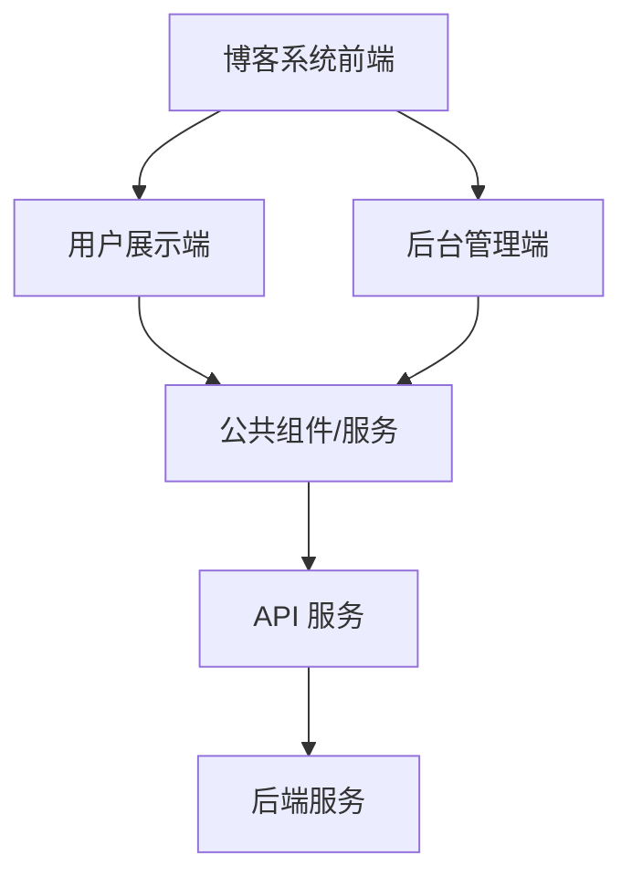
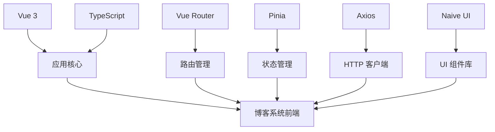

# 博客系统设计文档

## 概述

本设计文档详细描述了博客系统前端的架构设计、组件设计、数据模型和接口设计。该系统包括用户展示端和后台管理端两个主要部分，使用 Vue 3、TypeScript、Vue Router、Pinia、Axios 和 Naive UI 构建。

## 架构设计

### 整体架构

博客系统前端采用单页应用(SPA)架构，基于 Vue 3 框架实现。系统分为用户展示端和后台管理端两个主要部分，共享部分公共组件和服务。



### 技术架构



### 目录结构

```
src/
├── assets/            # 静态资源
│   ├── images/        # 图片资源
│   └── styles/        # 样式资源
├── components/        # 公共组件
├── composables/       # 组合式函数
├── config/            # 配置文件
├── directives/        # 自定义指令
├── hooks/             # 自定义钩子
├── layouts/           # 布局组件
├── plugins/           # 插件
├── router/            # 路由配置
├── services/          # 服务层
├── stores/            # Pinia 状态管理
├── types/             # TypeScript 类型定义
├── utils/             # 工具函数
├── views/             # 页面视图
│   ├── admin/         # 管理端视图
│   └── /              # 用户端视图
├── App.vue            # 根组件
└── main.ts            # 入口文件
```

## 组件和接口设计

### 核心组件

#### 1. 布局组件

**用户展示端布局 (AppLayout)**

- 包含页头、导航菜单、内容区域和页脚
- 响应式设计，适配不同设备屏幕

**后台管理端布局 (AdminLayout)**

- 包含侧边栏导航、顶部工具栏和内容区域
- 基于用户权限动态生成菜单

#### 2. 认证组件

**登录组件 (LoginForm)**

- 用户名/密码输入
- 表单验证
- 记住登录状态
- 错误提示

**权限控制组件 (AuthGuard)**

- 路由导航守卫
- 权限检查
- 未授权重定向

#### 3. 内容组件

**文章列表组件 (ArticleList)**

- 分页显示
- 排序和筛选
- 预览摘要

**文章详情组件 (ArticleDetail)**

- 完整内容显示
- 标签和分类信息
- 相关文章推荐

**文章编辑器组件 (ArticleEditor)**

- Markdown编辑器
- 图片上传
- 自动保存
- 预览功能

**文件上传组件 (FileUpload)**

- 支持拖拽上传
- 文件类型和大小验证
- 上传进度显示

#### 4. 管理组件

**数据看板组件 (Dashboard)**

- 数据统计卡片
- 基于 ECharts 的趋势图表
- 最近活动列表

**搜索组件 (SearchBox)**

- 实时搜索建议
- 搜索历史记录
- 高级搜索筛选

**表格管理组件 (DataTable)**

- 通用 CRUD 操作
- 批量操作
- 搜索和筛选
- 导出功能

### 接口设计

#### 1. 用户接口

```typescript
// 用户类型定义
interface User {
  id: string
  username: string
  nickname: string
  email: string
  avatar: string
  role: Role
  status: 'active' | 'inactive' | 'banned'
  createTime: string
  updateTime: string
}

// 角色类型定义
interface Role {
  id: string
  name: string
  code: string
  description?: string
  permissions: Permission[]
}

// 权限类型定义
interface Permission {
  id: string
  code: string
  description?: string
}
```

#### 2. 内容接口

```typescript
// 文章类型定义
interface Article {
  id: string
  title: string
  content: string
  summary?: string
  coverImage?: string
  author: User
  tags: Tag[]
  category: Category
  status: 'draft' | 'published' | 'archived'
  viewCount: number
  commentCount: number
  likeCount: number
  publishTime?: string
  createTime: string
  updateTime: string
}

// 标签类型定义
interface Tag {
  id: string
  name: string
  color?: string
  articleCount: number
}

// 分类类型定义
interface Category {
  id: string
  name: string
  description?: string
  articleCount: number
}

// 文件上传类型定义
interface FileUpload {
  id: string
  filename: string
  originalName: string
  size: number
  mimeType: string
  url: string
  uploadTime: string
}
```

## 数据模型

### 状态管理模型

使用 Pinia 进行状态管理，主要包括以下几个 Store：

#### 1. 用户状态 (userStore)

```typescript
interface UserState {
  currentUser: User | null
  token: string | null
  isAuthenticated: boolean
  role: Role
  permissions: string[]
}
```

#### 2. 文章状态 (articleStore)

```typescript
interface ArticleState {
  articles: Article[]
  currentArticle: Article | null
  loading: boolean
  error: Error | null
  pagination: {
    page: number
    size: number
    total: number
  }
  filters: {
    category?: string
    tag?: string
    keyword?: string
    status?: string
  }
}
```

#### 3. 标签和分类状态 (taxonomyStore)

```typescript
interface TaxonomyState {
  tags: Tag[]
  categories: Category[]
  loading: boolean
  error: Error | null
}
```

#### 4. 应用状态 (appStore)

```typescript
interface AppState {
  theme: 'light' | 'dark'
  sidebar: {
    collapsed: boolean
  }
  notifications: Notification[]
  settings: AppSettings
}
```

### API 服务模型

使用 Axios 封装 API 请求，主要包括以下几个服务：

#### 1. 认证服务 (authService)

```typescript
interface AuthService {
  login(username: string, password: string): Promise<{ token: string; refreshToken: string }>
  logout(): Promise<void>
  refreshToken(): Promise<string>
  getCurrentUser(): Promise<User>
  updatePassword(oldPassword: string, newPassword: string): Promise<boolean>
}
```

#### 2. 文章服务 (articleService)

```typescript
interface ArticleService {
  getArticles(params: ArticleQueryParams): Promise<PaginatedResponse<Article>>
  getArticleById(id: string): Promise<Article>
  createArticle(article: ArticleCreateDto): Promise<Article>
  updateArticle(id: string, article: ArticleUpdateDto): Promise<Article>
  deleteArticle(id: string): Promise<boolean>
  publishArticle(id: string): Promise<boolean>
  unpublishArticle(id: string): Promise<boolean>
}
```

#### 3. 标签和分类服务 (taxonomyService)

```typescript
interface TaxonomyService {
  getTags(): Promise<Tag[]>
  getCategories(): Promise<Category[]>
  createTag(tag: TagCreateDto): Promise<Tag>
  createCategory(category: CategoryCreateDto): Promise<Category>
  updateTag(id: string, tag: TagUpdateDto): Promise<Tag>
  updateCategory(id: string, category: CategoryUpdateDto): Promise<Category>
  deleteTag(id: string): Promise<boolean>
  deleteCategory(id: string): Promise<boolean>
}
```

#### 4. 用户和权限服务 (userService)

```typescript
interface UserService {
  getUsers(params: UserQueryParams): Promise<PaginatedResponse<User>>
  getUserById(id: string): Promise<User>
  createUser(user: UserCreateDto): Promise<User>
  updateUser(id: string, user: UserUpdateDto): Promise<User>
  deleteUser(id: string): Promise<boolean>
  getRoles(): Promise<Role[]>
  getPermissions(): Promise<Permission[]>
  assignRole(userId: string, roleId: string): Promise<boolean>
}
```

#### 5. 文件上传服务 (uploadService)

```typescript
interface UploadService {
  uploadFile(file: File): Promise<FileUpload>
  uploadFiles(files: File[]): Promise<FileUpload[]>
  deleteFile(id: string): Promise<boolean>
  getFileList(params: FileQueryParams): Promise<PaginatedResponse<FileUpload>>
  getFileById(id: string): Promise<FileUpload>
}
```

#### 6. 搜索服务 (searchService)

```typescript
interface SearchService {
  searchArticles(keyword: string, params?: SearchParams): Promise<PaginatedResponse<Article>>
  getSearchSuggestions(keyword: string): Promise<string[]>
  getSearchHistory(): Promise<string[]>
  saveSearchHistory(keyword: string): Promise<void>
  clearSearchHistory(): Promise<void>
}
```

## 错误处理

### 全局错误处理

1. **API 错误处理**

   - 使用 Axios 拦截器统一处理 HTTP 错误
   - 根据错误类型（网络错误、服务器错误、认证错误等）提供不同的处理策略
   - 对特定错误码进行特殊处理（如 401 自动跳转登录页）

2. **组件错误处理**

   - 使用 Vue 的 errorCaptured 钩子捕获组件渲染错误
   - 实现全局错误边界组件，防止整个应用崩溃
   - 提供友好的错误提示界面

3. **日志记录**
   - 记录错误信息到控制台
   - 对关键错误进行远程日志收集
   - 包含错误上下文信息，便于调试

## 安全考虑

1. **认证与授权**

   - 使用 access token 进行身份验证
   - 实现细粒度的权限控制
   - 定期刷新 Token

2. **数据安全**

   - 敏感数据加密存储
   - 防止 XSS 攻击
   - 防止 CSRF 攻击

3. **输入验证**
   - 客户端和服务器端双重验证
   - 防止 SQL 注入
   - 防止恶意脚本注入

## 性能优化

1. **代码分割**

   - 路由懒加载
   - 组件异步加载
   - 第三方库按需导入

2. **缓存策略**

   - 本地缓存常用数据
   - 使用 Service Worker 缓存静态资源
   - 实现数据预加载

3. **渲染优化**
   - 虚拟滚动大列表
   - 图片懒加载
   - 避免不必要的重渲染

## 环境配置

系统将支持以下环境配置：

1. **开发环境 (Development)**

   - 用于本地开发和调试
   - 包含详细的日志和调试信息
   - 使用模拟数据或开发服务器

2. **生产环境 (Production)**
   - 用于线上部署
   - 优化性能和资源加载
   - 禁用调试工具和详细日志
   - 使用生产环境API和服务

环境配置通过环境变量和配置文件进行管理，确保不同环境下系统行为的一致性和可预测性。
